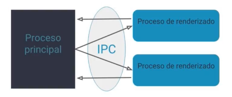

# Electron

* Es un framework para crear aplicaciones de escritotio con tecnologias web.

* Lo crearon github, para crear atom editor.

* MacOS (cocoa)

* Windows (Windos Form)

* Linux (gtk o qt)

* Necesita node.js y chromiun para funcionar.

  * Node.js se encarga del proceso principal. Es el encargado de conectar con todas las partes nativas del sistema operativo, como los menus, los dialogos, las ventanas, todos estos componentes que son nativos del Sistema operativo.
  * Chromiun, permite ver el contenido visual.

* Comunicación entre procesos (IPC).

  * Esta permite la comuncación entre el proceso principal que esta corriendo en node.js y el proceso de rendeizado.

  

## Herramientas

### Windows

Se debe instalar lo siguiente, esto instala las dependencias para compilar modulos para ello necesita c y python.

```bash
npm install --global windows-build-tools
```

## Cargar contenido

* Como es una ventana de un navegador, se puede cargar contenido local (html local) o externo (urls externas).
* Cuando es contenido local la carga es inmediata, pero cuando se carga contenido remoto se depende de la red.

## Electron compile

* Permite escribir en diferentes tecnologías que no estan soportadas de forma nativa en html y compila el código en tiempo de ejecucion para despreocuparse de ese paso.

```shell
npm i -D electron
```


*cross-env:* Módulo para que se utilice las variables de entorno sin importar como se definen en los distintos sistemas operativos.

```json
"dev": "cross-env NODE_ENV=development electron src/index.js"
```

### Módulos deprecados

* *electron-debug:* Se utiliza para habilitar las herramientas de chrome dev tools, agrega unos shorcups para lanzar la devtools,
* *devtron:* Son las herreamientas oficiales de Electron para hacer debug de la aplicación.

### Frameworks para aplicaciones de escritorio

* *photonkit.com:* Los componentes son muy similares a los de MacOS.
* *Xel:* Esta hecho para aplicativos de electron, parecido a material design. Utiliza templates esta basado en webcomponents

## JavaScript en el Frontend

* Tenemos acceso al API: DOM, de nodejs y de electron.

## Comunicación Proceso principal y proceso de renderizado.

* ipcRender: Es el objeto que corre en el proceso de renderizado y permite comunicarse con el main process.
* ipcMain: Protocolo de comunicación para el proceso principal.

## Errores

* Eventos de crashed: Son eventos cuando la pantalla muere.
* unresponsive: Cuando la pantalla no responde
* uncaughtException: Son las excepciones que no fueron manejadas.

## Module remote

* Desde el proceso de renderizado permite llamar a partes del API del proceso principal, como por ejemplo: BrowserWindow
* Se llama desde el proceso de renderizado pero esta utilizando el proceso principal.

## Guardar información de preferencias

* El local storage tiene un problema ya que no esta disponible en el proceso principal. Tendría que compartirce la información a través de IPC.
* Sqlite
* Archivo en una ruta especifica. Electron ofrece una forma de guardar en las preferencias del usuario.

## API Tray

* Solo esta disponible en el Main Process.
* Es un EventEmitter.
* Hay limitaciones por sistema operativo, sobre todo en Linux ya que este maneja muchos entornos graficos.
* Los iconos para windows son .ico y para mac y linux son .png.

### API Clibboard

* Portapapeles.

## Notification

* Es el API de notificaciones del navegador.
* Electron no requiere de ningun permiso para lanzarlas, electron hace bypass de esto.

### Api Shell

* Es un API que permite abrir externamente una url.

## Generar ejecutables

* electron-packager: Genera todos los ejecutables para las diferentes plataformas.
* electron-builder: Es una suit completa, esta compuesta por un electron pakager y un generador de instaladores.
* electron-forge: No solo ayuda a empaquetar y distribuir el instalador, también ayuda en el desarrollo de la aplicación. Mantenido por electro user lang.

## Electron forge

Importar el proyecto:

Desde la carpeta raiz del proyecto ejcutar:

```shell
npx @electron-forge/cli import
```

### iconverticons.com

* Es un sitio para exportar iconos para los diferentes sistemas operativos.

## Distribución

* Se debe crear instaladores para cada plataforma para que el usuario pueda instalarlo.
* Se utiliza los make targets, estos son todos los parametros necesarios para crear los instaladores para diferentes plataformas.
* Recomienda electron-forge para generar los instaladores para distintas plataforas, se debe crearlas en las propias plataformas ya que tienen las herramientas necesarias para que queden bien.
* FIrmar el paquete: Tiene que ver con la seguridad de la aplicación y la distribución masiva. Con el fin de que el usuario final no corra riesgos al momento de utilizar aplicaciones. Para ello Apple y Microsoft an diseñado unos programas donde se debe tener un certificado de seguridad para poder firmar nuestras aplicaciones.
  * Microsoft: Hay que adquirir un certificado llamado Code Signing y uno de los proveedores  es Symantec.
  * Apple: Se debe ser miembro del programa de developers de Apple. El developer ID.
* Con electron forge se puede especificar el certificado.

## Sistemas de integración continua

* Es un sistema que esta constante revisando el codigo una vez que se ha realizado cambios, sirve para correrles test, hacer tareas con cada nuevo release. Va correr ciertas tareas por nosotros. Generarian los nuevos release al publicar un release.
* travis: Para sistemas operativos linux y mac.
* AppVeyor: Para sistemas windows.

## Probar aplicaciones electron.

* Electron utiliza Spectron, el cual utilizan ChromeDriver y WebDriverIO. Capturan la ventana de electron y permiten correr testing. Trabaja con ava


